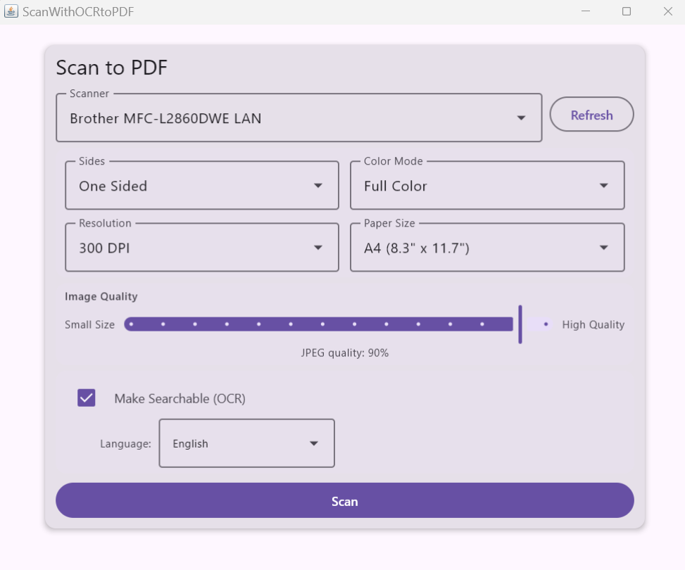

# ScanWithOCRtoPDF

A Windows 11 desktop application that scans documents and saves them as searchable PDF files.

## What you can do

- **Scan to PDF in one click** — select your scanner, hit Scan, and get a PDF
- **Make PDFs searchable** — OCR runs automatically so you can search and copy text inside the PDF
- **Scan multiple pages** — after each scan you can add more pages before building the final PDF
- **Choose scan quality** — pick Full Color, Grayscale, or Black & White
- **Choose paper size** — Letter, A4, or Legal
- **Choose resolution** — 75 to 1200 DPI
- **Scan one side or both** — one-sided or duplex (if your scanner supports it)
- **Control file size** — the quality slider trades image sharpness against file size
- **14 OCR languages** — English, French, German, Spanish, Italian, Portuguese, Dutch, Polish, Russian, Japanese, Chinese (Simplified & Traditional), Korean, and Arabic
- **Cancel any time** — a Cancel button stops the scan mid-way

## Screenshots



## Requirements

- Windows 11 (64-bit)
- Any WIA-compatible scanner (Brother, HP, Canon, Epson, etc.)

## Installation

Download and run the MSI installer — no Java installation required, everything is bundled.

## Getting Started (from source)

```
./gradlew run
```

To build an installable MSI:

```
./gradlew packageMsi
```

The installer is written to `build/compose/binaries/main/msi/`.

## License

Apache License 2.0 — see [LICENSE](LICENSE) for details.
